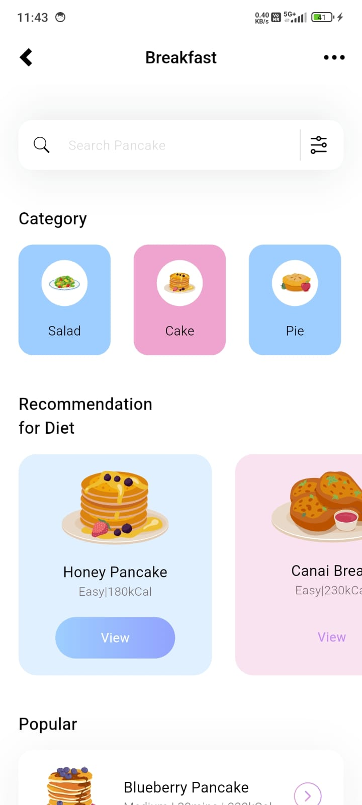
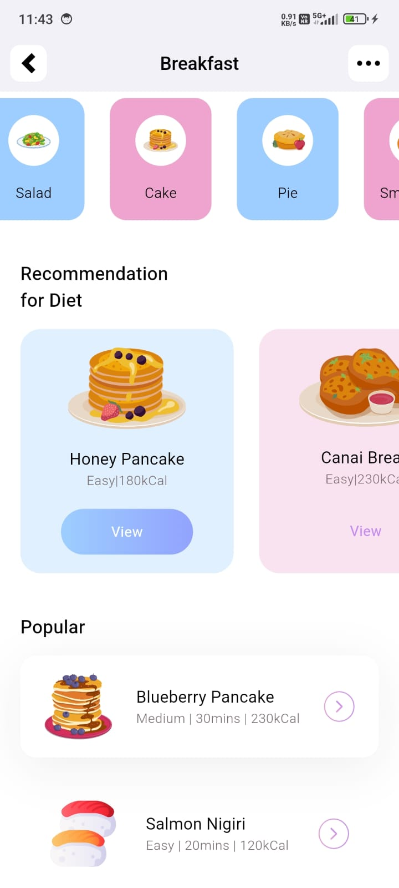

# 🍳 Breakfast Recipe UI

This is a simple and clean Flutter UI project focused on breakfast recipes. It was created as part of my Flutter learning journey to practice layout design, widget composition, and UI responsiveness.

## 📱 Screenshot




## ✨ Features

- Modern and aesthetic Flutter UI
- Search bar with filter icon
- Food category cards (e.g., Salad, Cake, Pie)
- Diet-based recommendations (e.g., Honey Pancake, Canai Bread)
- Popular items list

## 🎯 Purpose

This project was made to:

- Learn and practice basic Flutter UI design
- Explore layout widgets like `Row`, `Column`, `Container`, `ListView`, and `GridView`
- Develop clean, structured UI screens suitable for mobile apps

## 🚀 Getting Started

To run this project locally:

1. **Clone the repository:**
   ```bash
   git clone https://github.com/your-username/breakfast-recipe-ui.git
   cd breakfast-recipe-ui

2. **Install dependencies:**
    flutter pub get

3. **Run the app:**
    Run the app:

## 🛠️ Tech Stack

    Flutter
    Dart

## 📌 Note
This project is UI-only and does not include backend or functionality (e.g., navigation, data handling). It is meant purely for design practice.

## 📬 Feedback
Feel free to fork this repo, open issues, or submit pull requests if you have suggestions or improvements!
